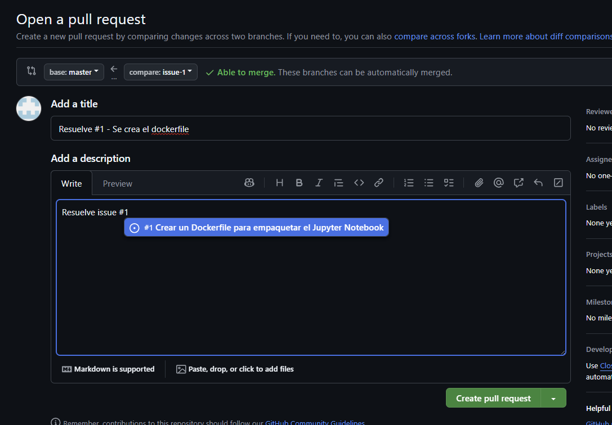
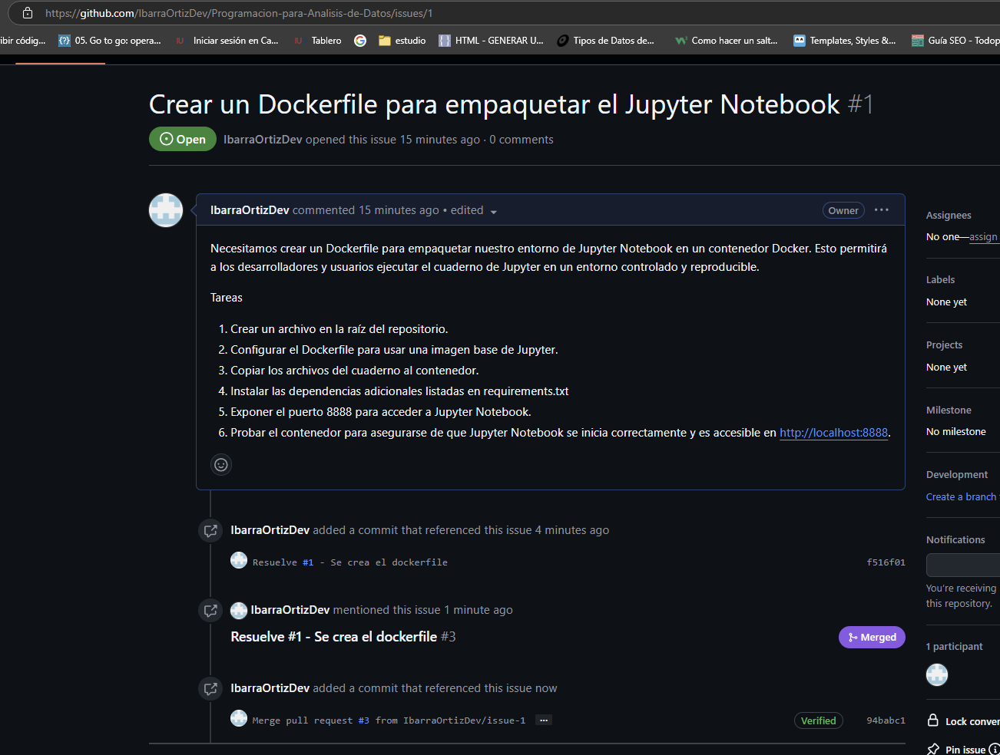
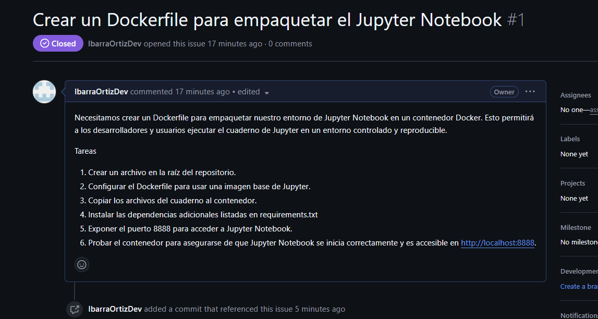

<div style="text-align:center">

</div>

<br/>

<div style="text-align:center">
 <h2>S30 - Evidencia de aprendizaje 2. Optimizando la productividad en el mundo del software</h2>
</div>
<br/>
<div style="text-align:center">
 <h3>Edwin Alexander Ibarra Ortiz</h3>
 <h3>PREICA2402B020101</h3>
</div>
<br/>
<br/>

<div style="text-align:center">
 <h3>IU Digital de Antioquia</h3>
 <h3>Ingeniería de Software y Datos</h3>
 <h3>2024</h3>
</div>
<hr>

## Introducción

El presente trabajo tiene como objetivo principal la publicación en GitHub de una aplicación desarrollada en Jupyter Notebook utilizando Visual Studio Code. Este proceso incluye la creación de un repositorio, la gestión de ramas y la integración de cambios mediante un merge. Además, se documentarán los pasos realizados y las decisiones técnicas en un archivo Markdown, con el fin de garantizar la claridad y la replicabilidad del proyecto. Este ejercicio busca fortalecer habilidades relacionadas con el control de versiones, la colaboración en equipo y la documentación adecuada de proyectos de desarrollo.

## Objetivos

1. Crear y gestionar un repositorio en GitHub: Establecer un repositorio en la plataforma, configurando una rama principal y una alterna, con el fin de simular un flujo de trabajo colaborativo y ordenado.

2. Implementar un flujo de control de versiones básico: Crear una rama alterna para incorporar cambios específicos y realizar el merge hacia la rama principal, garantizando la integridad del proyecto.

3. Documentar el proceso de entrega: Desarrollar un archivo Markdown que detalle las acciones realizadas, las decisiones técnicas tomadas y las funcionalidades añadidas, para asegurar una entrega clara y comprensible.

4. Incorporar la funcionalidad de empaquetado con Docker: Abrir y gestionar un issue para solicitar la creación de un Dockerfile que permita empaquetar el proyecto de Jupyter Notebook, integrando los cambios en el repositorio y cerrando el issue de manera adecuada.

## Resultados

### Avidencia #1: Se crea el respectivo repositorio publico

[GitHub](https://github.com/IbarraOrtizDev/Programacion-para-Analisis-de-Datos)


Es importante que se tenga en cuenta que para encontrar la manera de navegar por el repositorio es necesario leer el readme principal, en el se mencionan las entregas realizadas hasta el momento y las que se haran a futuro

### Evidencia #2: Se crea la rama Actividad2, con el objetivo de ir seccionando cada entrega por rama, anque seguramente en algun momento se eliminaran cuando se realice el pull request con la rama principal (master)


#### Merge a rama principal


#### Se elimina rama Actividad2


#### Se crea un issue para dejar tareas pendientes y probar esta parte de la plataforma:


#### Se crea el dockerfile y se cierra el issue



#### Se evidencia que el PR si quedo amarrado al issue






#### Si desea crear la instancia de docker
``` bash
docker build -t mi-jupyter-notebook .
docker run -p 8888:8888 mi-jupyter-notebook
```

## Conclusiones

1. Gestión efectiva de proyectos con GitHub: El proceso de creación de un repositorio, el manejo de ramas, la integración de cambios mediante merge y la gestión de issues reflejó la importancia de GitHub como una herramienta esencial para organizar y colaborar en proyectos de desarrollo.

2. Introducción al empaquetado con Docker: La incorporación de un Dockerfile al proyecto destacó la relevancia de esta tecnología para la portabilidad y despliegue de aplicaciones, permitiendo empaquetar el Jupyter Notebook en un entorno reproducible y estandarizado.

3. Relevancia de la documentación técnica: La elaboración de un archivo Markdown que describe las acciones realizadas y los pasos seguidos aseguró una entrega estructurada y comprensible, reforzando la importancia de la documentación como parte integral de cualquier proyecto.