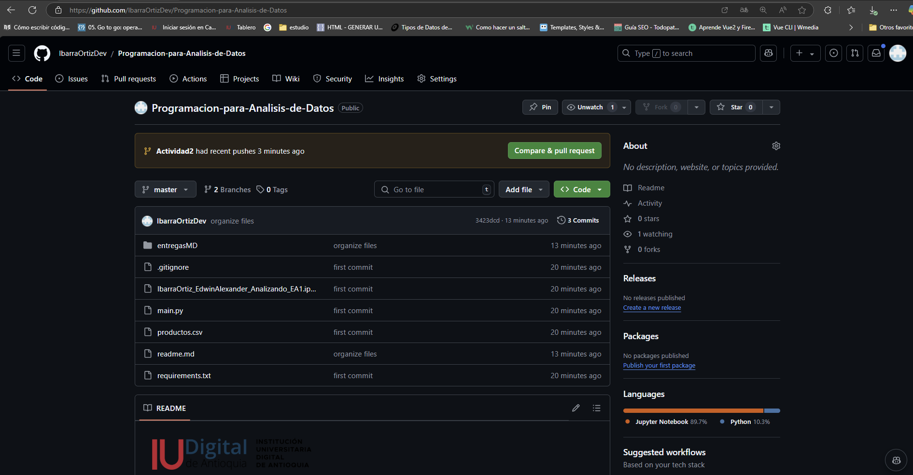
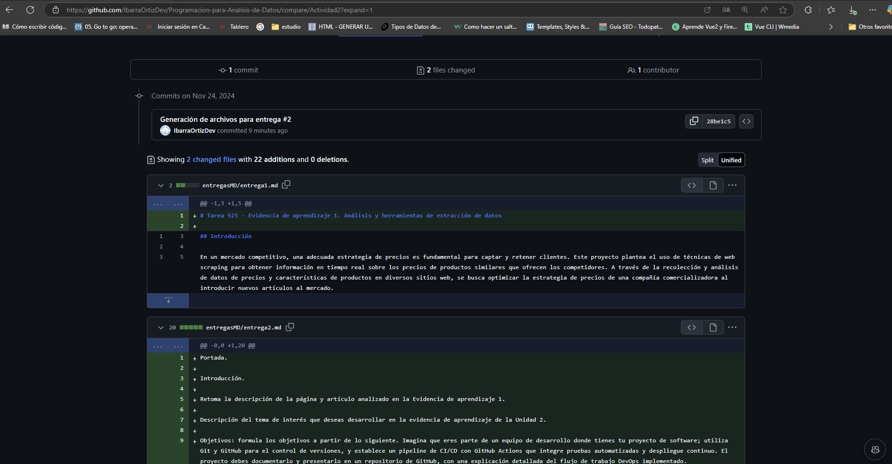
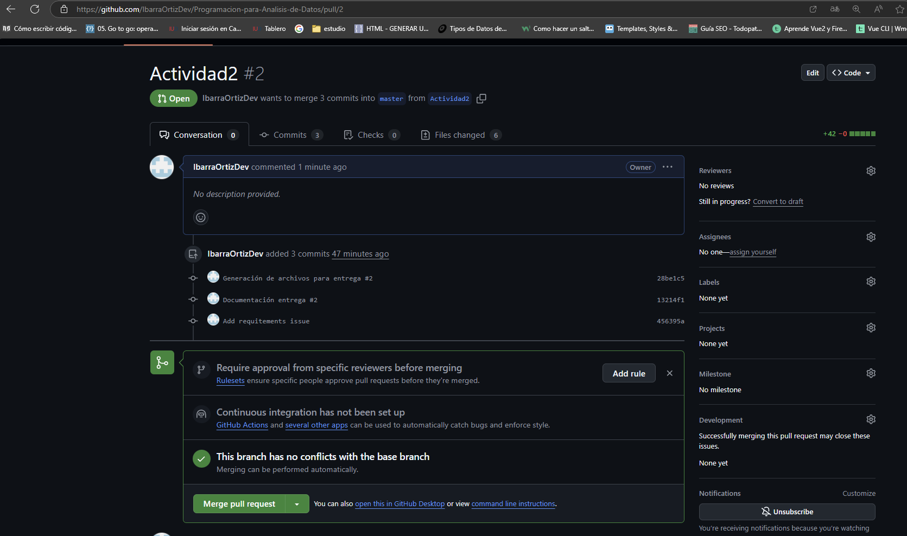
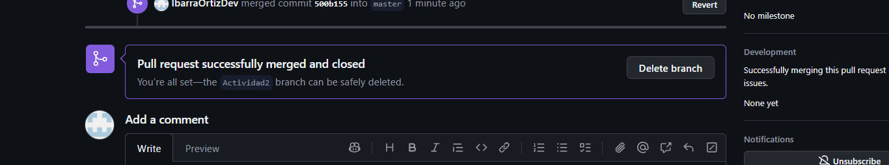
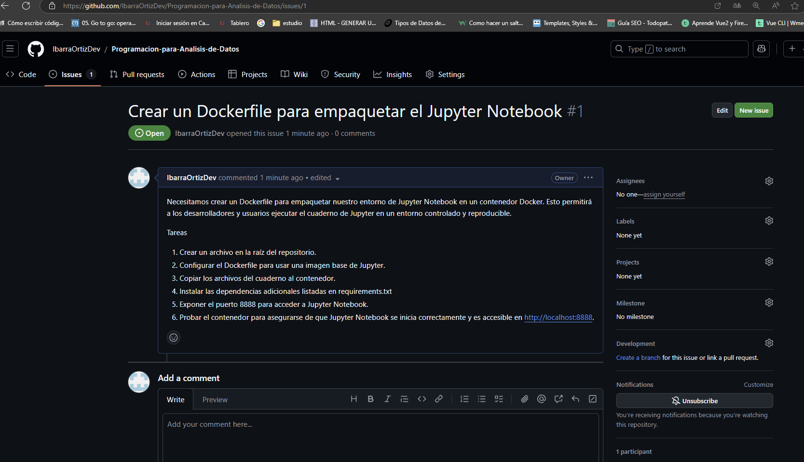

Portada.

Introducción.

Retoma la descripción de la página y artículo analizado en la Evidencia de aprendizaje 1.

Descripción del tema de interés que deseas desarrollar en la evidencia de aprendizaje de la Unidad 2.

Objetivos: formula los objetivos a partir de lo siguiente. Imagina que eres parte de un equipo de desarrollo donde tienes tu proyecto de software; utiliza Git y GitHub para el control de versiones, y establece un pipeline de CI/CD con GitHub Actions que integre pruebas automatizadas y despliegue continuo. El proyecto debes documentarlo y presentarlo en un repositorio de GitHub, con una explicación detallada del flujo de trabajo DevOps implementado.

Metodología empleada de Scraping.

Resultados y conclusiones.

Bibliografía (Normas APA).

# S30 - Evidencia de aprendizaje 2. Optimizando la productividad en el mundo del software

## Introducción

El presente trabajo tiene como objetivo principal la publicación en GitHub de una aplicación desarrollada en Jupyter Notebook utilizando Visual Studio Code. Este proceso incluye la creación de un repositorio, la gestión de ramas y la integración de cambios mediante un merge. Además, se documentarán los pasos realizados y las decisiones técnicas en un archivo Markdown, con el fin de garantizar la claridad y la replicabilidad del proyecto. Este ejercicio busca fortalecer habilidades relacionadas con el control de versiones, la colaboración en equipo y la documentación adecuada de proyectos de desarrollo.

## Resultados

### Avidencia #1: Se crea el respectivo repositorio publico

[GitHub](https://github.com/IbarraOrtizDev/Programacion-para-Analisis-de-Datos)

Es importante que se tenga en cuenta que para encontrar la manera de navegar por el repositorio es necesario leer el readme principal, en el se mencionan las entregas realizadas hasta el momento y las que se haran a futuro

### Evidencia #2: Se crea la rama Actividad2, con el objetivo de ir seccionando cada entrega por rama, anque seguramente en algun momento se eliminaran cuando se realice el pull request con la rama principal (master)

#### Merge a rama principal

#### Se elimina rama Actividad2

#### Se crea un issue para dejar tareas pendientes y probar esta parte de la plataforma:

